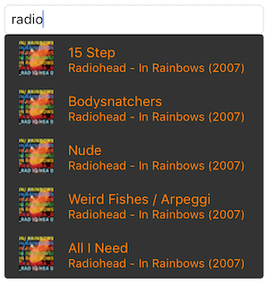

ASJDropDownMenu
================

iOS doesn't have a drop down menu by default. Developers are supposed to use the ```UIPickerView``` for similar functionality. Project design constraints may sometimes however necessitate the use of such a menu. This class is a subclass of `UIView` that has a `UITableView` embedded in it. It provides the functionality needed to show a drop down menu below a `UITextField` and is customisable using various properties.

Creating one is simple. The show method has a completion block which returns the selected item. You may hide the drop down there and then:

```objc
ASJDropDownMenu *dropDownMenu = [[ASJDropDownMenu alloc] initWithTextField:aTextField];
dropDownMenu.menuItems = anArrayOfStrings;
[dropDown showMenuWithCompletion:^(ASJDropDownMenu *dropDownMenu, NSString *selectedItem, NSUInteger index) {
  myTextField.text = selectedItem;
  [dropDownMenu hideMenu];
}];
```



###To-do
- Animation to open and close
- Provision to add images
- Provision to close on item selection
- Option to open the drop down in up or down direction
- Move the screen to accomodate the drawer when keyboard shows

# License

ASJDropDownMenu is available under the MIT license. See the LICENSE file for more info.